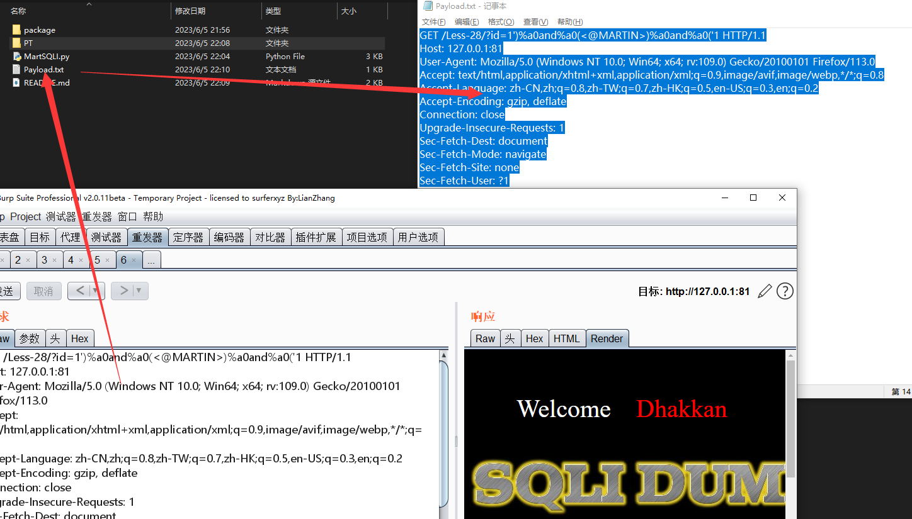

  

 
 
  
 
 
 
 

  
  
   
 <table>
  <tr>
      <th>Function</th>
  </tr>
  <tr>
    <th>SQL injection automatically obtains server configuration information</th>
</tr>
 
 </table>

  
## MartSQLI Example

``#python3 MartSQLI.py -h``

 

## SQL Inject

``Fetching messages``

 

``Copy message to payload.txt``

``#python3 MartSQLI.py -f ./payload.txt -e Login -p "<@MARTIN>" ``

